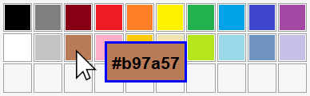

# PixelPicker

  
<b>A <a href="https://en.wikipedia.org/wiki/Java_(programming_language)">Java</a> applicattion that indicates the color of the pixel that is currently being touched with the cursor at any place of your desktop. <b>

  

